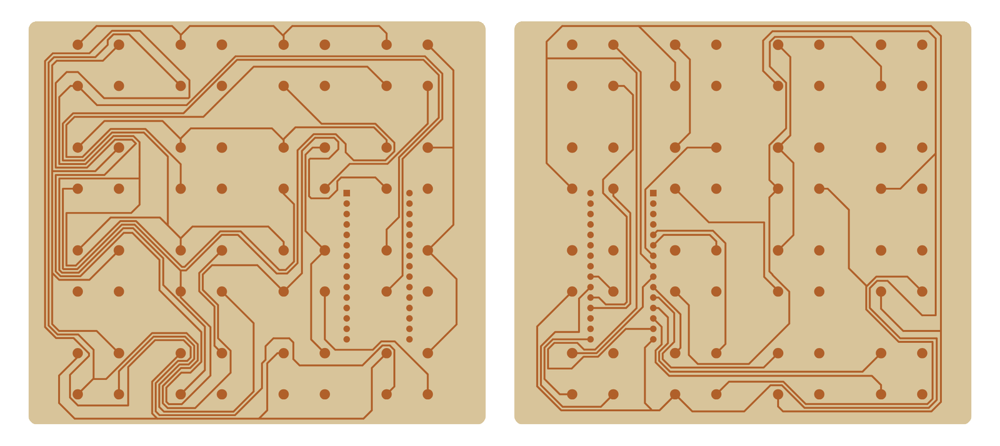

# LED cube (formerly "galina")

A **4 × 4 × 4 RGB LED cube**, built twice:

- **V1:** the cube is driven straight from an **FPGA**. The SystemVerilog design scans the cube one LED at a time: it selects a column through a shift register, selects a layer, and applies 8-bit PWM to each colour channel.
- **V2:** the cube sits on a custom KiCad PCB carrying an **Arduino Nano (ATmega328P)**. It uses a charlieplexing library and a set of animations.

🎥 **Demo video:** [`docs/images/Galina_Results.mp4`](docs/images/Galina_Results.mp4). The video is 720p; GitHub shows a download or preview link for it.


<sub>V2 carrier PCB, rendered from <code>electrical/led_cube_pcb/GBR</code>.</sub>

## Status

| Area | Status |
|---|---|
| FPGA (V1) | ✅ Vivado project, testbenches and four prebuilt bitstreams |
| PCB (V2) | ✅ Routed; Gerbers exported, including a set prepared for a CNC etcher |
| Firmware (V2) | ✅ Animations running (see video) |
| Mechanical | ✅ PCB case, soldering jig, cut files |

## Repository layout

```
led_cube_project/
├── fpga/led_cube_v1/              Vivado project "Galina" (V1)
│   ├── Galina.xpr
│   ├── Galina.srcs/sources_1/new/ top_level.sv, led_driver_fsm.sv, write.sv, pwm.sv
│   ├── Galina.srcs/sources_1/ip/  clk_wiz_0 (clocking wizard)
│   ├── Galina.srcs/sim_1/         testbenches
│   ├── Galina.srcs/constrs_1/     .xdc constraints
│   ├── wcfg/                      saved waveform views for each testbench
│   └── runs/*.bit                 prebuilt bitstreams
├── electrical/led_cube_pcb/       KiCad 6 PCB for V2 (+ GBR/ Gerbers)
├── firmware/led_cube_firmware/    PlatformIO project for V2 (Arduino Nano)
├── mechanical/
│   ├── cad/                       SolidWorks: cube parts, Soldering_Jig.SLDASM
│   ├── cam/                       3D-print (.3mf), CNC-etcher Gerbers
│   └── exports/                   STL (PCB case + cover), SVG (laser-cut soldering jig)
└── docs/images/Galina_Results.mp4
```

## V1: FPGA driver (`fpga/led_cube_v1`)

**Target:** Xilinx Artix-7 **XC7A100T-CSG324** (`xc7a100tcsg324-3`), using the Nexys A7 / Nexys 4 DDR pinout. The 100 MHz clock is on pin E3, the cube connects through Pmod headers **JA** and **JB**, and `btnc`, `sw[15:0]` and `led[15:0]` come from the board.

**How it works:**

| Module | Role |
|---|---|
| `top_level.sv` | Holds the frame buffer `led_cube[4 layers][16 LEDs][24-bit RGB]` and a demo pattern generator. With `sw[0]` on, the cube cycles through white, red, green and blue every 4,000,000 clocks; `btnc` resets it. The board LEDs mirror the switches. |
| `led_driver_fsm.sv` | The scan FSM. For each LED in the current layer, it writes a one-hot 16-bit column pattern into the shift register and then runs a PWM slot for that pixel's RGB value. Each layer gets `MAX_CYCELS_PER_PLANE = 20833` clocks (16 slots of about 1302 clocks), after which it advances `z_level`. |
| `write.sv` | Shifts 16 bits out to a serial-in, parallel-out shift register chain. It drives SER, SRCLK and SRCLR, then pulses the latch. |
| `pwm.sv` | 8-bit PWM of the pixel's R, G and B bytes within one slot |
| `clk_wiz_0` | Divides the 100 MHz board clock down for the driver |

**Pmod pinout:**

| Pmod pin | Signal |
|---|---|
| `ja[0]` | shift-register serial data (SER) |
| `ja[1]` | shift clock (SRCLK) |
| `ja[2]` | shift-register clear (SRCLR, active low) |
| `ja[3]` | latch (RCLK) |
| `ja[4]`, `ja[5]`, `ja[6]` | red, green, blue PWM |
| `jb[3:0]` | one-hot layer select (z = 0…3) |

**Bitstreams** in `runs/` are `Brightness.bit`, `Checker.bit`, `EitherSide.bit` and `Full_Cube_Flash.bit`. Each is a different demo pattern.

**Rebuild or program:**
1. Open `Galina.xpr` in Vivado. The project was saved with **Vivado 2019.2**; newer versions will offer to upgrade it and the `clk_wiz_0` IP.
2. Run synthesis, implementation and bitstream generation.
3. Use Hardware Manager to program the board, or load one of the prebuilt `.bit` files.
4. To simulate, open any testbench in `sim_1` with its matching `.wcfg` from `wcfg/`.

## V2: Arduino carrier PCB (`electrical/led_cube_pcb`)

- KiCad 6, 2 layers, 111 × 98 mm.
- An **Arduino Nano v3** socket, sixteen **2 × 2 headers** (`J0,0` to `J3,3`, one per cube column, 4 leads each), and a 2-pin screw terminal for power.
- Gerbers are in `GBR/`. A copy set up for the desktop CNC etcher is in `mechanical/cam/CNC_Etcher/`.

## V2: firmware (`firmware/led_cube_firmware`)

| Setting | Value |
|---|---|
| Platform | `atmelavr`, board `nanoatmega328new` (Nano with the new bootloader), Arduino framework |
| Sources | `src/Firmware.ino` (animation loop), `src/cubeplex.h` (charlieplexing driver), `src/mappings.h` (pin-to-LED map), `src/niceTimer.h` |

The animations are `randomLed`, `planarSpin`, `fountian`, `trifade`, `shiftSquares`, `tunnel`, `chaseTheDot` and `planarFlop3D`.

```bash
cd firmware/led_cube_firmware
pio run -t upload          # Nano over USB
```

`platformio.ini` also points `lib_extra_dirs` at `~/Documents/Arduino/libraries`. The project doesn't need anything from there, because everything is in `src/`.

> **Credit:** `cubeplex.h`, `mappings.h`, `niceTimer.h` and the animation code in `Firmware.ino` come from **Asher Glick's** charlieplexed RGB cube library (Copyright © 2012 Asher Glick, BSD license; the full text is in `src/LICENCE` and in each file header). My work in V2 is the PCB, the build and the integration.

## Mechanical

| File | What |
|---|---|
| `cad/Soldering_Jig/Soldering_Jig.SLDASM` + `exports/svg/Soldering_Jig/*.svg` | Laser-cut jig that holds LEDs in a 4 × 4 grid while soldering each layer |
| `exports/stl/Galina_PCB_Case.STL`, `Galina_PCB_Cover.STL` | 3D-printed enclosure for the V2 PCB (`cam/3D_Printer/Galina_PCB_Casse.3mf` is the print project) |
| `cad/Galina/Parts/` | Cube part models |

## Reproducing

1. Laser-cut the soldering jig from the SVGs, then solder four 4 × 4 layers of common-lead RGB LEDs and stack them into columns.
2. **V2:** mill or order the PCB from `GBR/`, fit a Nano, plug each column into its 2 × 2 header, and flash the firmware.
3. **V1:** wire the Pmod pins as in the table above to a 16-bit shift-register column driver and four layer drivers, then program a bitstream.
